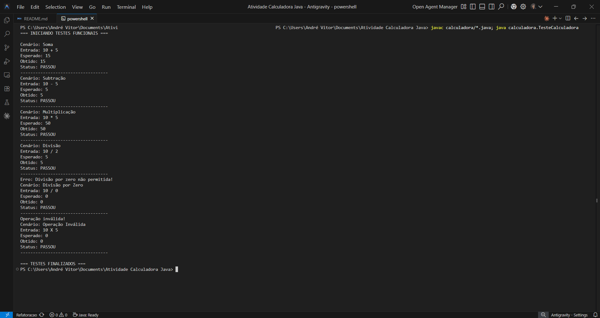
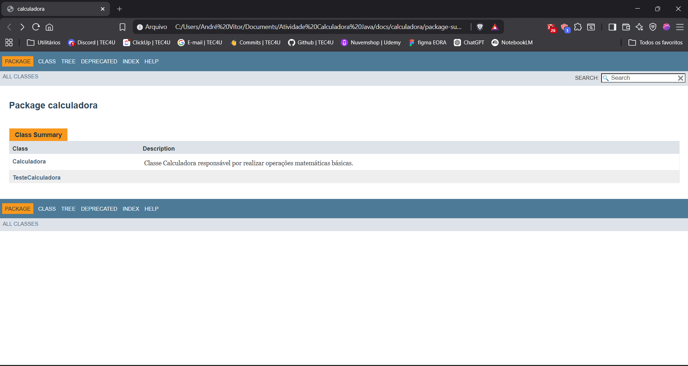

# Projeto Calculadora - FinançApp

Este projeto consiste em uma calculadora funcional desenvolvida em Java, focada em demonstrar boas práticas de qualidade de software, incluindo testes funcionais, refatoração e documentação técnica.

## 🎯 Objetivo da Atividade
Desenvolver a capacidade prática na construção, validação e manutenção de software, aplicando conceitos de:
- Testes unitários e funcionais.
- Tratamento de erros e exceções.
- Refatoração de código para melhoria de legibilidade.
- Documentação técnica via JavaDoc.
- Versionamento de software com Git/GitHub.

## 🚀 Tecnologias Utilizadas
- **Linguagem:** Java 11+
- **Documentação:** JavaDoc
- **Versionamento:** Git & GitHub

## 🔢 Operações Suportadas
A calculadora realiza as seguintes operações matemáticas básicas:
1. **Soma (`+`):** Adição de dois números inteiros.
2. **Subtração (`-`):** Diferença entre dois números inteiros.
3. **Multiplicação (`*`):** Produto de dois números inteiros.
4. **Divisão (`/`):** Quociente da divisão (com proteção contra divisão por zero).

## 🧪 Execução de Testes
O projeto conta com uma classe de testes (`TesteCalculadora.java`) que valida todos os cenários, incluindo entradas inválidas e divisões críticas.

### Resultado dos Testes:

## 📚 Documentação JavaDoc
A documentação técnica foi gerada automaticamente e pode ser encontrada na pasta `docs/`.

### Exemplo da Documentação:

## 🌿 Estrutura de Branches
O repositório está organizado em duas principais branches para demonstrar a evolução:
- **`main`**: Contém a estrutura básica e os testes funcionais iniciais.
- **`Refatoracao`**: Contém o código final refatorado, com JavaDoc completo e documentação HTML gerada.

## 🔗 Repositório
[Link do Repositório no GitHub](https://github.com/andrecodedev/atividade_calculadora)

---
**Desenvolvido por André Vitor** (salesdias1207@gmail.com)
